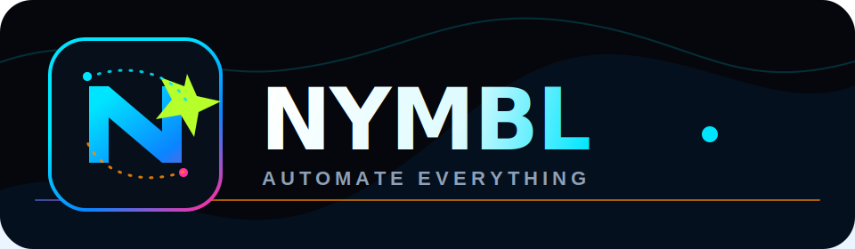

<div align="center">



# Nymbl — Automate Your Marketing

**We automate your marketing — so you don't have to.**

A high-energy demo landing page for a marketing automation business serving owner-operators across industries.

---


</div>

---

## About

**Nymbl** is a demo landing page for a marketing automation service targeting busy owner-operators — realtors, insurance agents, contractors, skydiving schools, jewelry makers, boutiques, and more.

The site showcases the **AI Social Video** automation as its flagship feature while positioning Nymbl as a full-service automation partner across 9,000+ connected apps.

> This is a **demo / prototype** — wired to Stripe test mode, placeholder booking links, and a simulated AI video script generator. Replace the placeholders listed in the Go-Live Checklist below before launching.

---

## Features

| Feature | Description |
|---|---|
| 🎬 **AI Social Video** | Interactive form that simulates an AI-generated video script from your prompt |
| 📅 **Bookings via Cal.com** | "Book a 15-min Call" CTA throughout — drop in your Cal.com link to go live |
| 💳 **Stripe Subscriptions** | Three-tier pricing (Kickstart $50 · Cruise Control $150 · Full Throttle $500) |
| ⚡ **Zapier Integration** | Demo form submissions routed to a Zapier webhook (ready to wire) |
| 📋 **Lead Capture Form** | Audience-targeted form with vibe, style, and selling-point fields |
| 📺 **YouTube / Social Proof** | Video placeholder + social media embeds (swap in your real content) |
| 🤖 **OpenAI Scaffold** | Script preview generation endpoint ready to swap for a real OpenAI call |
| 🔁 **Automation Marquee** | Infinite-scroll strip of every supported business type |
| ✨ **Scroll Animations** | Framer Motion reveal animations throughout |

---

## Stack

| Layer | Technology |
|---|---|
| Framework | React 18 + Vite 5 |
| Language | TypeScript (strict) |
| Styling | Tailwind CSS |
| Animation | Framer Motion |
| Payments | Stripe (subscriptions, test mode) |
| Bookings | Cal.com |
| Automation | Zapier (webhook) |
| AI / Script Gen | OpenAI (scaffold ready) |
| Social Video | YouTube embed (placeholder) |
| Deployment | Replit / Vercel / Netlify / Cloudflare Pages |

---

## Project Structure

```
artifacts/nymbl/
├── public/
│   ├── favicon.svg
│   └── opengraph.jpg
├── src/
│   ├── pages/
│   │   └── Home.tsx         ← all 9 page sections
│   ├── App.tsx
│   ├── main.tsx
│   └── index.css            ← gradient animations + marquee keyframes
├── index.html
├── vite.config.ts
└── package.json
```

---

## Getting Started

```bash
# Install dependencies
pnpm install

# Start dev server
pnpm dev
```

Open `http://localhost:5173` in your browser.

---

## Go-Live Checklist

- [ ] Replace `#booking` with your real **Cal.com** booking URL
- [ ] Swap Stripe **test keys** (`sk_test_`) for live keys (`sk_live_`) when ready to charge
- [ ] Wire the demo form to a real **Zapier webhook** endpoint
- [ ] Embed real **YouTube / LinkedIn / Instagram** proof content
- [ ] Drop a real **AI-generated video** into the video placeholder section
- [ ] Replace the **OpenAI scaffold** with a live API call for real script generation
- [ ] Set YouTube video privacy to **public**
- [ ] Point to your real domain and remove Replit dev URLs

---

## Author

<div align="center">

<a href="https://github.com/jdbostonbu-ops">
  
</a>

**[@jdbostonbu-ops](https://github.com/jdbostonbu-ops)**

Live: [https://repplit-nymbl.vercel.app/](https://repplit-nymbl.vercel.app/)

Built with 🔥 on [Replit](https://replit.com)

</div>

---

## License

MIT — use it, fork it, ship it.

---

<div align="center">

If this project helped you, please consider giving it a ⭐ — it helps others find it!

[](https://github.com/jdbostonbu-ops)

</div>
